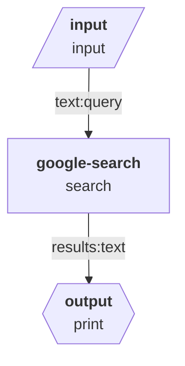

# just-search
---

```mermaid
graph TD;
input[/"`**input**
input`"/]:::input -- text:query --> search["`**google-search**
search`"]
search["`**google-search**
search`"] -- results:text --> print{{"`**output**
print`"}}:::output
```