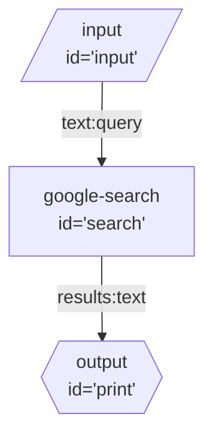

# just-search
---

```mermaid
graph TD;
input[/"input
id='input'"/]:::input -- text:query --> search["google-search
id='search'"]
search["google-search
id='search'"] -- results:text --> print{{"output
id='print'"}}:::output
```