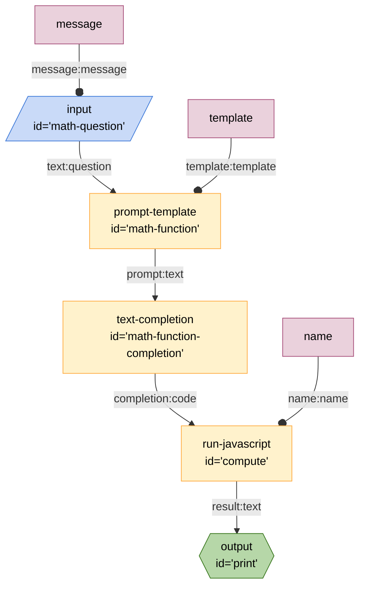

# math
---

```mermaid
%%{init: 'themeVariables': { 'fontFamily': 'Fira Code, monospace' }}%%
graph TD;
mathquestion[/"input
id='math-question'"/]:::input -- text:question --> mathfunction["prompt-template
id='math-function'"]
mathfunction["prompt-template
id='math-function'"] -- prompt:text --> mathfunctioncompletion["text-completion
id='math-function-completion'"]
mathfunctioncompletion["text-completion
id='math-function-completion'"] -- completion:code --> compute["run-javascript
id='compute'"]
compute["run-javascript
id='compute'"] -- result:text --> print{{"output
id='print'"}}:::output
messagemathquestion[message]:::config -- message:message --o mathquestion
templatemathfunction[template]:::config -- template:template --o mathfunction
namecompute[name]:::config -- name:name --o compute
classDef default stroke:#ffab40,fill:#fff2ccff,color:#000
classDef input stroke:#3c78d8,fill:#c9daf8ff,color:#000
classDef output stroke:#38761d,fill:#b6d7a8ff,color:#000
classDef passthrough stroke:#a64d79,fill:#ead1dcff,color:#000
classDef slot stroke:#a64d79,fill:#ead1dcff,color:#000
classDef config stroke:#a64d79,fill:#ead1dcff,color:#000
classDef slotted stroke:#a64d79
```