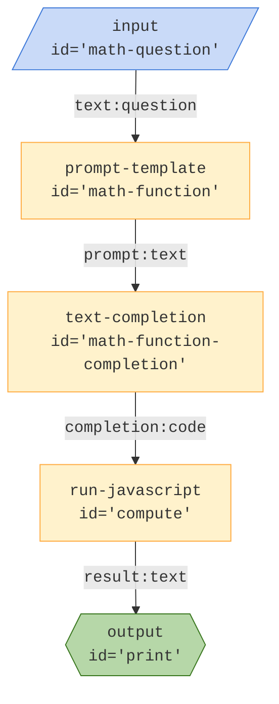

# math
---

```mermaid
%%{init: {'theme':'default', 'themeVariables': { 'fontFamily': 'Fira Code, monospace', 'background': '#fff' }}}%%
graph TD;
math-question[/"input
id='math-question'"/]:::input -- text:question --> math-function["prompt-template
id='math-function'"]
math-function["prompt-template
id='math-function'"] -- prompt:text --> math-function-completion["text-completion
id='math-function-completion'"]
math-function-completion["text-completion
id='math-function-completion'"] -- completion:code --> compute["run-javascript
id='compute'"]
compute["run-javascript
id='compute'"] -- result:text --> print{{"output
id='print'"}}:::output
classDef default stroke:#ffab40,fill:#fff2ccff
classDef input stroke:#3c78d8,fill:#c9daf8ff
classDef output stroke:#38761d,fill:#b6d7a8ff
classDef passthrough stroke:#a64d79,fill:#ead1dcff
```