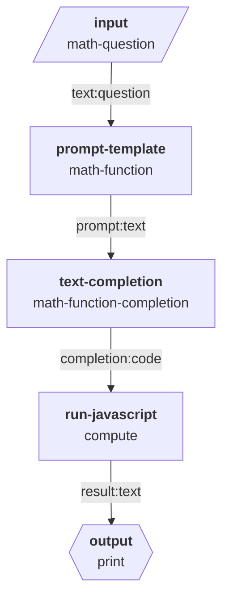

# math
---

```mermaid
graph TD;
math-question[/"`**input**
math-question`"/]:::input -- text:question --> math-function["`**prompt-template**
math-function`"]
math-function["`**prompt-template**
math-function`"] -- prompt:text --> math-function-completion["`**text-completion**
math-function-completion`"]
math-function-completion["`**text-completion**
math-function-completion`"] -- completion:code --> compute["`**run-javascript**
compute`"]
compute["`**run-javascript**
compute`"] -- result:text --> print{{"`**output**
print`"}}:::output
```