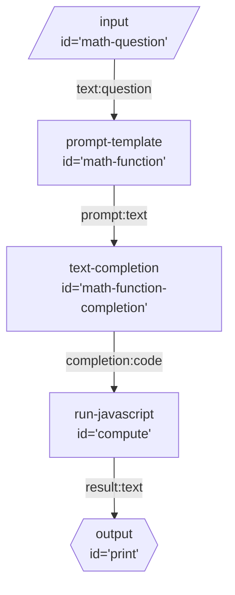

# math
---

```mermaid
graph TD;
math-question[/"input
id='math-question'"/]:::input -- text:question --> math-function["prompt-template
id='math-function'"]
math-function["prompt-template
id='math-function'"] -- prompt:text --> math-function-completion["text-completion
id='math-function-completion'"]
math-function-completion["text-completion
id='math-function-completion'"] -- completion:code --> compute["run-javascript
id='compute'"]
compute["run-javascript
id='compute'"] -- result:text --> print{{"output
id='print'"}}:::output
```