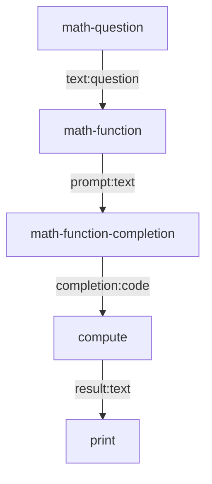

# math
---

```mermaid
graph TD;
math-question -- text:question --> math-function
math-function -- prompt:text --> math-function-completion
math-function-completion -- completion:code --> compute
compute -- result:text --> print
```