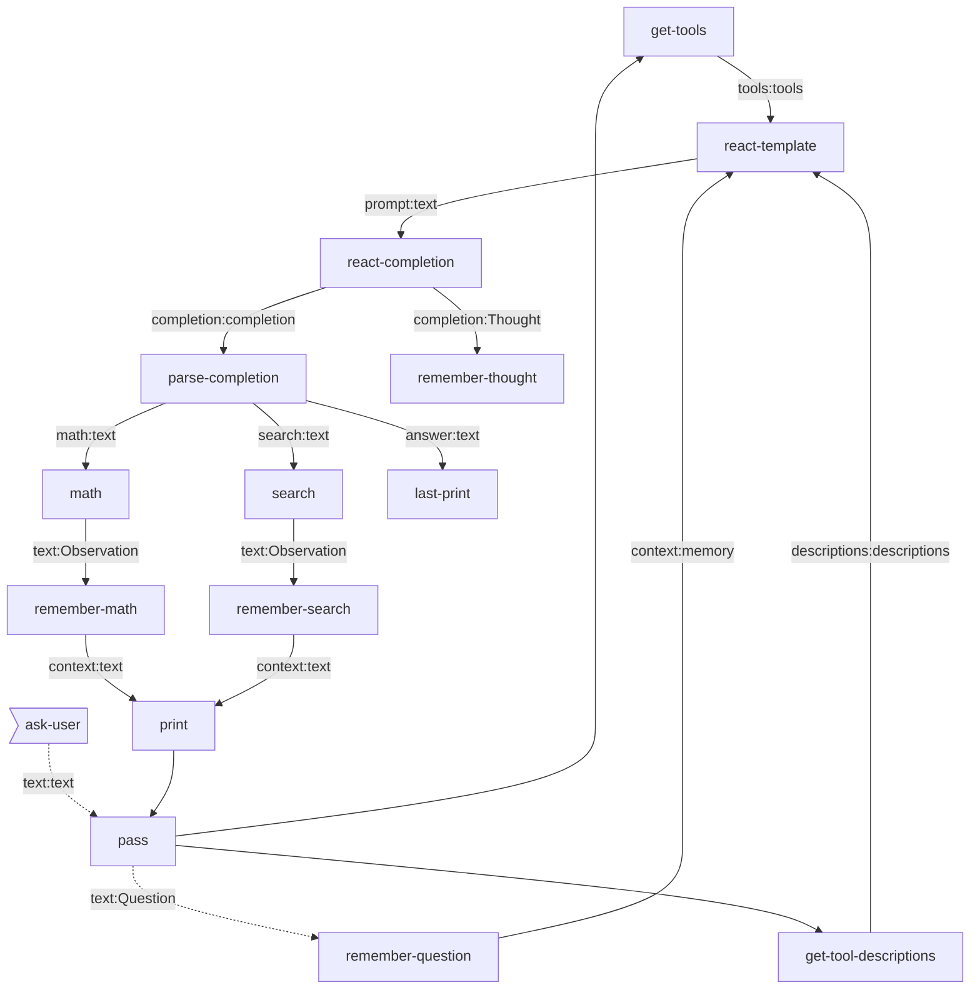

# react-with-include
---

```mermaid
graph TD;
get-tools -- tools:tools --> react-template
get-tool-descriptions -- descriptions:descriptions --> react-template
ask-user>ask-user] -. text:text .-> pass
pass --> get-tools
pass -. text:Question .-> remember-question
remember-question -- context:memory --> react-template
pass --> get-tool-descriptions
react-template -- prompt:text --> react-completion
react-completion -- completion:completion --> parse-completion
react-completion -- completion:Thought --> remember-thought
parse-completion -- search:text --> search
parse-completion -- math:text --> math
math -- text:Observation --> remember-math
remember-math -- context:text --> print
search -- text:Observation --> remember-search
remember-search -- context:text --> print
print --> pass
parse-completion -- answer:text --> last-print
```