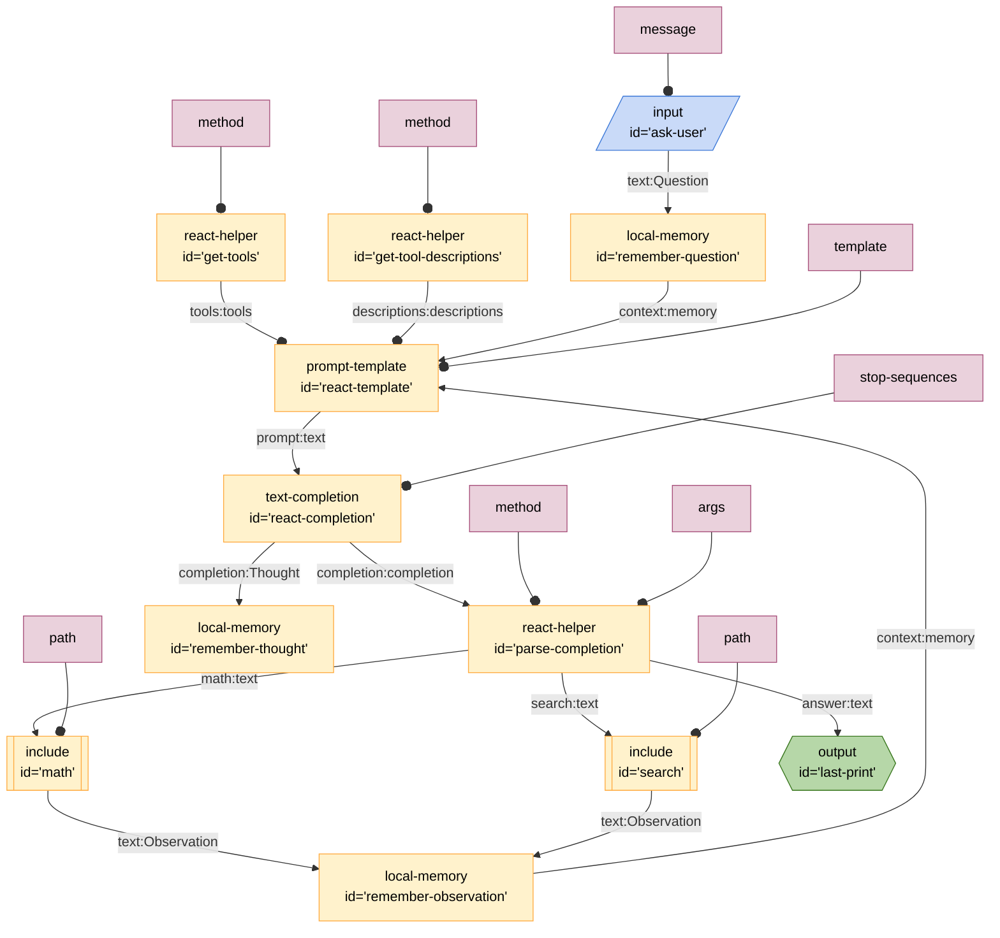

# react-with-include
---

```mermaid
%%{init: 'themeVariables': { 'fontFamily': 'Fira Code, monospace' }}%%
graph TD;
gettools["react-helper
id='get-tools'"] -- tools:tools --o reacttemplate["prompt-template
id='react-template'"]
gettooldescriptions["react-helper
id='get-tool-descriptions'"] -- descriptions:descriptions --o reacttemplate["prompt-template
id='react-template'"]
askuser[/"input
id='ask-user'"/]:::input -- text:Question --> rememberquestion["local-memory
id='remember-question'"]
rememberquestion["local-memory
id='remember-question'"] -- context:memory --> reacttemplate["prompt-template
id='react-template'"]
reacttemplate["prompt-template
id='react-template'"] -- prompt:text --> reactcompletion["text-completion
id='react-completion'"]
reactcompletion["text-completion
id='react-completion'"] -- completion:completion --> parsecompletion["react-helper
id='parse-completion'"]
reactcompletion["text-completion
id='react-completion'"] -- completion:Thought --> rememberthought["local-memory
id='remember-thought'"]
parsecompletion["react-helper
id='parse-completion'"] -- search:text --> search[["include
id='search'"]]:::include
parsecompletion["react-helper
id='parse-completion'"] -- math:text --> math[["include
id='math'"]]:::include
math[["include
id='math'"]]:::include -- text:Observation --> rememberobservation["local-memory
id='remember-observation'"]
search[["include
id='search'"]]:::include -- text:Observation --> rememberobservation["local-memory
id='remember-observation'"]
rememberobservation["local-memory
id='remember-observation'"] -- context:memory --> reacttemplate["prompt-template
id='react-template'"]
parsecompletion["react-helper
id='parse-completion'"] -- answer:text --> lastprint{{"output
id='last-print'"}}:::output
templatereacttemplate[template]:::config --o reacttemplate
messageaskuser[message]:::config --o askuser
stopsequencesreactcompletion[stop-sequences]:::config --o reactcompletion
methodgettools[method]:::config --o gettools
methodgettooldescriptions[method]:::config --o gettooldescriptions
methodparsecompletion[method]:::config --o parsecompletion
argsparsecompletion[args]:::config --o parsecompletion
pathsearch[path]:::config --o search
pathmath[path]:::config --o math
classDef default stroke:#ffab40,fill:#fff2ccff,color:#000
classDef input stroke:#3c78d8,fill:#c9daf8ff,color:#000
classDef output stroke:#38761d,fill:#b6d7a8ff,color:#000
classDef passthrough stroke:#a64d79,fill:#ead1dcff,color:#000
classDef slot stroke:#a64d79,fill:#ead1dcff,color:#000
classDef config stroke:#a64d79,fill:#ead1dcff,color:#000
classDef slotted stroke:#a64d79
```