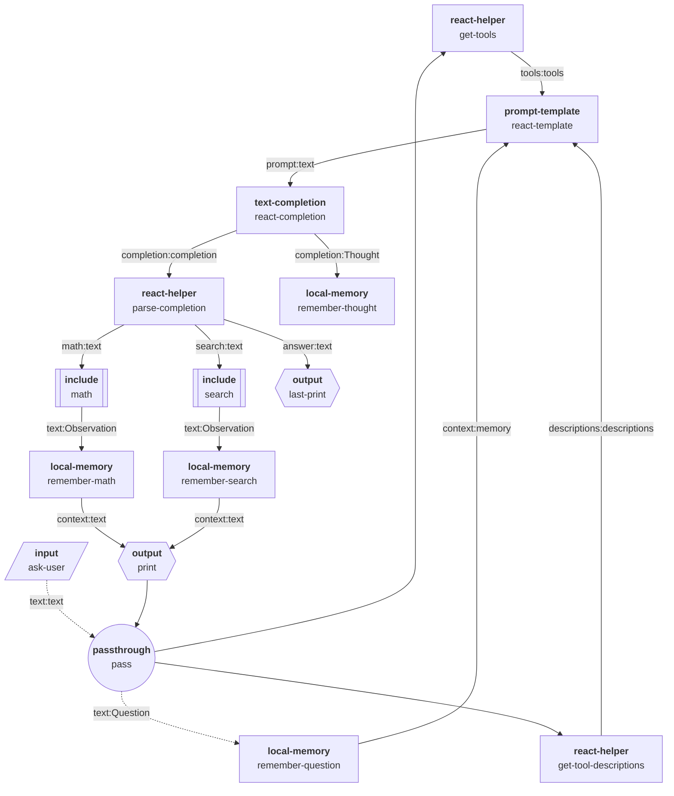

# react-with-include
---

```mermaid
graph TD;
get-tools["`**react-helper**
get-tools`"] -- tools:tools --> react-template["`**prompt-template**
react-template`"]
get-tool-descriptions["`**react-helper**
get-tool-descriptions`"] -- descriptions:descriptions --> react-template["`**prompt-template**
react-template`"]
ask-user[/"`**input**
ask-user`"/]:::input -. text:text .-> pass(("`**passthrough**
pass`")):::passthrough
pass(("`**passthrough**
pass`")):::passthrough --> get-tools["`**react-helper**
get-tools`"]
pass(("`**passthrough**
pass`")):::passthrough -. text:Question .-> remember-question["`**local-memory**
remember-question`"]
remember-question["`**local-memory**
remember-question`"] -- context:memory --> react-template["`**prompt-template**
react-template`"]
pass(("`**passthrough**
pass`")):::passthrough --> get-tool-descriptions["`**react-helper**
get-tool-descriptions`"]
react-template["`**prompt-template**
react-template`"] -- prompt:text --> react-completion["`**text-completion**
react-completion`"]
react-completion["`**text-completion**
react-completion`"] -- completion:completion --> parse-completion["`**react-helper**
parse-completion`"]
react-completion["`**text-completion**
react-completion`"] -- completion:Thought --> remember-thought["`**local-memory**
remember-thought`"]
parse-completion["`**react-helper**
parse-completion`"] -- search:text --> search[["`**include**
search`"]]:::include
parse-completion["`**react-helper**
parse-completion`"] -- math:text --> math[["`**include**
math`"]]:::include
math[["`**include**
math`"]]:::include -- text:Observation --> remember-math["`**local-memory**
remember-math`"]
remember-math["`**local-memory**
remember-math`"] -- context:text --> print{{"`**output**
print`"}}:::output
search[["`**include**
search`"]]:::include -- text:Observation --> remember-search["`**local-memory**
remember-search`"]
remember-search["`**local-memory**
remember-search`"] -- context:text --> print{{"`**output**
print`"}}:::output
print{{"`**output**
print`"}}:::output --> pass(("`**passthrough**
pass`")):::passthrough
parse-completion["`**react-helper**
parse-completion`"] -- answer:text --> last-print{{"`**output**
last-print`"}}:::output
```