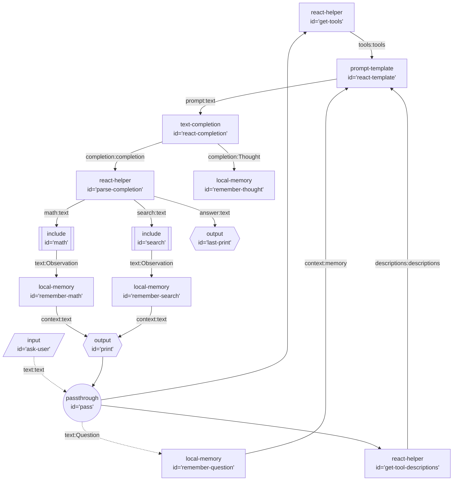

# react-with-include
---

```mermaid
graph TD;
get-tools["react-helper
id='get-tools'"] -- tools:tools --> react-template["prompt-template
id='react-template'"]
get-tool-descriptions["react-helper
id='get-tool-descriptions'"] -- descriptions:descriptions --> react-template["prompt-template
id='react-template'"]
ask-user[/"input
id='ask-user'"/]:::input -. text:text .-> pass(("passthrough
id='pass'")):::passthrough
pass(("passthrough
id='pass'")):::passthrough --> get-tools["react-helper
id='get-tools'"]
pass(("passthrough
id='pass'")):::passthrough -. text:Question .-> remember-question["local-memory
id='remember-question'"]
remember-question["local-memory
id='remember-question'"] -- context:memory --> react-template["prompt-template
id='react-template'"]
pass(("passthrough
id='pass'")):::passthrough --> get-tool-descriptions["react-helper
id='get-tool-descriptions'"]
react-template["prompt-template
id='react-template'"] -- prompt:text --> react-completion["text-completion
id='react-completion'"]
react-completion["text-completion
id='react-completion'"] -- completion:completion --> parse-completion["react-helper
id='parse-completion'"]
react-completion["text-completion
id='react-completion'"] -- completion:Thought --> remember-thought["local-memory
id='remember-thought'"]
parse-completion["react-helper
id='parse-completion'"] -- search:text --> search[["include
id='search'"]]:::include
parse-completion["react-helper
id='parse-completion'"] -- math:text --> math[["include
id='math'"]]:::include
math[["include
id='math'"]]:::include -- text:Observation --> remember-math["local-memory
id='remember-math'"]
remember-math["local-memory
id='remember-math'"] -- context:text --> print{{"output
id='print'"}}:::output
search[["include
id='search'"]]:::include -- text:Observation --> remember-search["local-memory
id='remember-search'"]
remember-search["local-memory
id='remember-search'"] -- context:text --> print{{"output
id='print'"}}:::output
print{{"output
id='print'"}}:::output --> pass(("passthrough
id='pass'")):::passthrough
parse-completion["react-helper
id='parse-completion'"] -- answer:text --> last-print{{"output
id='last-print'"}}:::output
```