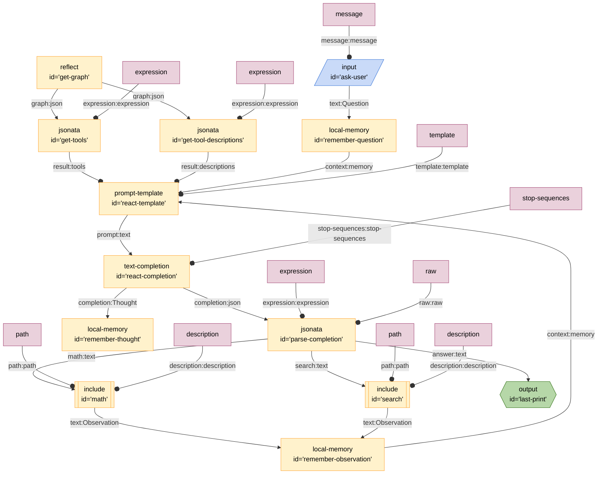

# react-with-jsonata
---

```mermaid
%%{init: 'themeVariables': { 'fontFamily': 'Fira Code, monospace' }}%%
graph TD;
getgraph["reflect
id='get-graph'"] -- graph:json --> gettools["jsonata
id='get-tools'"]
getgraph["reflect
id='get-graph'"] -- graph:json --> gettooldescriptions["jsonata
id='get-tool-descriptions'"]
gettools["jsonata
id='get-tools'"] -- result:tools --o reacttemplate["prompt-template
id='react-template'"]
gettooldescriptions["jsonata
id='get-tool-descriptions'"] -- result:descriptions --o reacttemplate["prompt-template
id='react-template'"]
askuser[/"input
id='ask-user'"/]:::input -- text:Question --> rememberquestion["local-memory
id='remember-question'"]
rememberquestion["local-memory
id='remember-question'"] -- context:memory --> reacttemplate["prompt-template
id='react-template'"]
reacttemplate["prompt-template
id='react-template'"] -- prompt:text --> reactcompletion["text-completion
id='react-completion'"]
reactcompletion["text-completion
id='react-completion'"] -- completion:json --> parsecompletion["jsonata
id='parse-completion'"]
reactcompletion["text-completion
id='react-completion'"] -- completion:Thought --> rememberthought["local-memory
id='remember-thought'"]
parsecompletion["jsonata
id='parse-completion'"] -- search:text --> search[["include
id='search'"]]:::include
parsecompletion["jsonata
id='parse-completion'"] -- math:text --> math[["include
id='math'"]]:::include
math[["include
id='math'"]]:::include -- text:Observation --> rememberobservation["local-memory
id='remember-observation'"]
search[["include
id='search'"]]:::include -- text:Observation --> rememberobservation["local-memory
id='remember-observation'"]
rememberobservation["local-memory
id='remember-observation'"] -- context:memory --> reacttemplate["prompt-template
id='react-template'"]
parsecompletion["jsonata
id='parse-completion'"] -- answer:text --> lastprint{{"output
id='last-print'"}}:::output
templatereacttemplate[template]:::config -- template:template --o reacttemplate
messageaskuser[message]:::config -- message:message --o askuser
stopsequencesreactcompletion[stop-sequences]:::config -- stop-sequences:stop-sequences --o reactcompletion
expressiongettools[expression]:::config -- expression:expression --o gettools
expressiongettooldescriptions[expression]:::config -- expression:expression --o gettooldescriptions
expressionparsecompletion[expression]:::config -- expression:expression --o parsecompletion
rawparsecompletion[raw]:::config -- raw:raw --o parsecompletion
pathsearch[path]:::config -- path:path --o search
descriptionsearch[description]:::config -- description:description --o search
pathmath[path]:::config -- path:path --o math
descriptionmath[description]:::config -- description:description --o math
classDef default stroke:#ffab40,fill:#fff2ccff,color:#000
classDef input stroke:#3c78d8,fill:#c9daf8ff,color:#000
classDef output stroke:#38761d,fill:#b6d7a8ff,color:#000
classDef passthrough stroke:#a64d79,fill:#ead1dcff,color:#000
classDef slot stroke:#a64d79,fill:#ead1dcff,color:#000
classDef config stroke:#a64d79,fill:#ead1dcff,color:#000
classDef slotted stroke:#a64d79
```