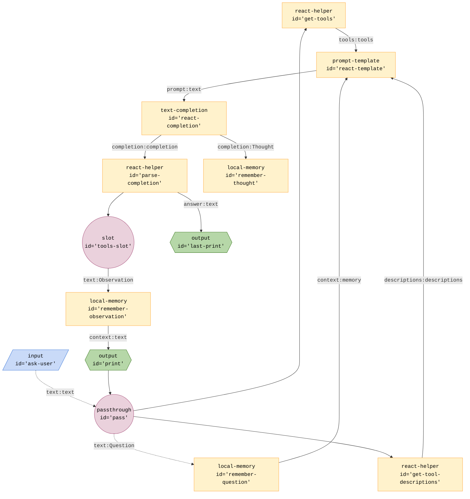

# react-with-slot
---

```mermaid
%%{init: {'themeVariables': { 'fontFamily': 'Fira Code, monospace' }}}%%
graph TD;
get-tools["react-helper
id='get-tools'"] -- tools:tools --> react-template["prompt-template
id='react-template'"]
get-tool-descriptions["react-helper
id='get-tool-descriptions'"] -- descriptions:descriptions --> react-template["prompt-template
id='react-template'"]
ask-user[/"input
id='ask-user'"/]:::input -. text:text .-> pass(("passthrough
id='pass'")):::passthrough
pass(("passthrough
id='pass'")):::passthrough --> get-tools["react-helper
id='get-tools'"]
pass(("passthrough
id='pass'")):::passthrough -. text:Question .-> remember-question["local-memory
id='remember-question'"]
remember-question["local-memory
id='remember-question'"] -- context:memory --> react-template["prompt-template
id='react-template'"]
pass(("passthrough
id='pass'")):::passthrough --> get-tool-descriptions["react-helper
id='get-tool-descriptions'"]
react-template["prompt-template
id='react-template'"] -- prompt:text --> react-completion["text-completion
id='react-completion'"]
react-completion["text-completion
id='react-completion'"] -- completion:completion --> parse-completion["react-helper
id='parse-completion'"]
react-completion["text-completion
id='react-completion'"] -- completion:Thought --> remember-thought["local-memory
id='remember-thought'"]
parse-completion["react-helper
id='parse-completion'"] --> tools-slot(("slot
id='tools-slot'")):::slot
tools-slot(("slot
id='tools-slot'")):::slot -- text:Observation --> remember-observation["local-memory
id='remember-observation'"]
remember-observation["local-memory
id='remember-observation'"] -- context:text --> print{{"output
id='print'"}}:::output
print{{"output
id='print'"}}:::output --> pass(("passthrough
id='pass'")):::passthrough
parse-completion["react-helper
id='parse-completion'"] -- answer:text --> last-print{{"output
id='last-print'"}}:::output
classDef default stroke:#ffab40,fill:#fff2ccff,color:#000
classDef input stroke:#3c78d8,fill:#c9daf8ff,color:#000
classDef output stroke:#38761d,fill:#b6d7a8ff,color:#000
classDef passthrough stroke:#a64d79,fill:#ead1dcff,color:#000
classDef slot stroke:#a64d79,fill:#ead1dcff,color:#000
classDef slotted stroke:#a64d79
```