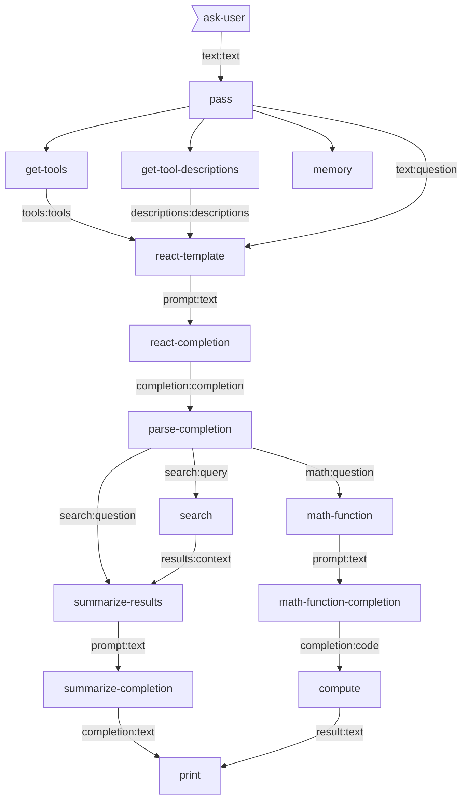

# react
---

```mermaid
graph TD;
get-tools -- tools:tools --> react-template
get-tool-descriptions -- descriptions:descriptions --> react-template
ask-user>ask-user] -- text:text --> pass
pass -- text:question --> react-template
pass --> get-tools
pass --> memory
pass --> get-tool-descriptions
react-template -- prompt:text --> react-completion
react-completion -- completion:completion --> parse-completion
parse-completion -- search:query --> search
parse-completion -- math:question --> math-function
parse-completion -- search:question --> summarize-results
search -- results:context --> summarize-results
summarize-results -- prompt:text --> summarize-completion
summarize-completion -- completion:text --> print
math-function -- prompt:text --> math-function-completion
math-function-completion -- completion:code --> compute
compute -- result:text --> print
```