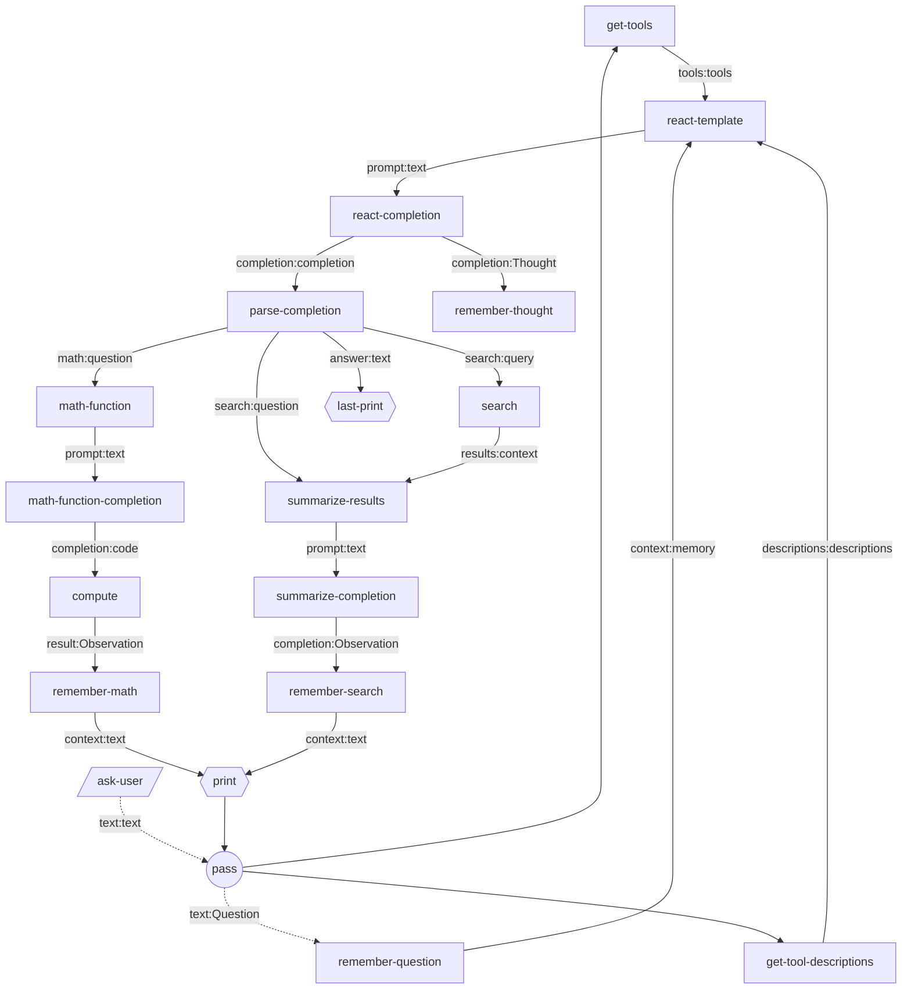

# react
---

```mermaid
graph TD;
get-tools -- tools:tools --> react-template
get-tool-descriptions -- descriptions:descriptions --> react-template
ask-user[/ask-user/] -. text:text .-> pass((pass))
pass((pass)) --> get-tools
pass((pass)) -. text:Question .-> remember-question
remember-question -- context:memory --> react-template
pass((pass)) --> get-tool-descriptions
react-template -- prompt:text --> react-completion
react-completion -- completion:completion --> parse-completion
react-completion -- completion:Thought --> remember-thought
parse-completion -- search:query --> search
parse-completion -- math:question --> math-function
parse-completion -- search:question --> summarize-results
search -- results:context --> summarize-results
summarize-results -- prompt:text --> summarize-completion
math-function -- prompt:text --> math-function-completion
math-function-completion -- completion:code --> compute
compute -- result:Observation --> remember-math
remember-math -- context:text --> print{{print}}
summarize-completion -- completion:Observation --> remember-search
remember-search -- context:text --> print{{print}}
print{{print}} --> pass((pass))
parse-completion -- answer:text --> last-print{{last-print}}
```