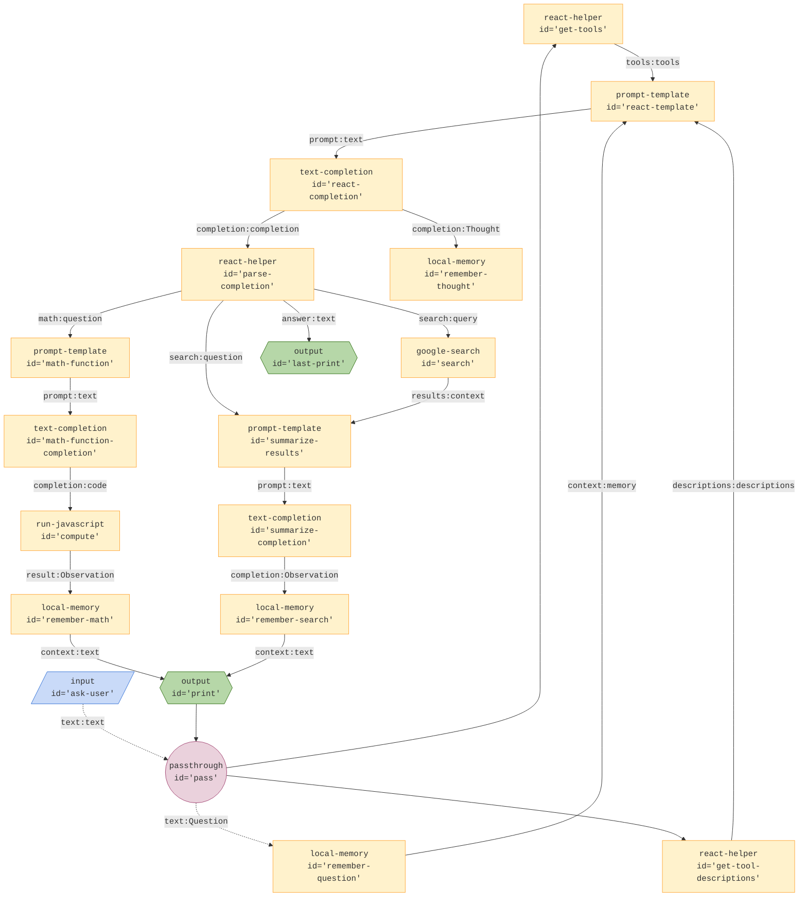

# react
---

```mermaid
%%{init: {'theme':'default', 'themeVariables': { 'fontFamily': 'Fira Code, monospace', 'background': '#fff' }}}%%
graph TD;
get-tools["react-helper
id='get-tools'"] -- tools:tools --> react-template["prompt-template
id='react-template'"]
get-tool-descriptions["react-helper
id='get-tool-descriptions'"] -- descriptions:descriptions --> react-template["prompt-template
id='react-template'"]
ask-user[/"input
id='ask-user'"/]:::input -. text:text .-> pass(("passthrough
id='pass'")):::passthrough
pass(("passthrough
id='pass'")):::passthrough --> get-tools["react-helper
id='get-tools'"]
pass(("passthrough
id='pass'")):::passthrough -. text:Question .-> remember-question["local-memory
id='remember-question'"]
remember-question["local-memory
id='remember-question'"] -- context:memory --> react-template["prompt-template
id='react-template'"]
pass(("passthrough
id='pass'")):::passthrough --> get-tool-descriptions["react-helper
id='get-tool-descriptions'"]
react-template["prompt-template
id='react-template'"] -- prompt:text --> react-completion["text-completion
id='react-completion'"]
react-completion["text-completion
id='react-completion'"] -- completion:completion --> parse-completion["react-helper
id='parse-completion'"]
react-completion["text-completion
id='react-completion'"] -- completion:Thought --> remember-thought["local-memory
id='remember-thought'"]
parse-completion["react-helper
id='parse-completion'"] -- search:query --> search["google-search
id='search'"]
parse-completion["react-helper
id='parse-completion'"] -- math:question --> math-function["prompt-template
id='math-function'"]
parse-completion["react-helper
id='parse-completion'"] -- search:question --> summarize-results["prompt-template
id='summarize-results'"]
search["google-search
id='search'"] -- results:context --> summarize-results["prompt-template
id='summarize-results'"]
summarize-results["prompt-template
id='summarize-results'"] -- prompt:text --> summarize-completion["text-completion
id='summarize-completion'"]
math-function["prompt-template
id='math-function'"] -- prompt:text --> math-function-completion["text-completion
id='math-function-completion'"]
math-function-completion["text-completion
id='math-function-completion'"] -- completion:code --> compute["run-javascript
id='compute'"]
compute["run-javascript
id='compute'"] -- result:Observation --> remember-math["local-memory
id='remember-math'"]
remember-math["local-memory
id='remember-math'"] -- context:text --> print{{"output
id='print'"}}:::output
summarize-completion["text-completion
id='summarize-completion'"] -- completion:Observation --> remember-search["local-memory
id='remember-search'"]
remember-search["local-memory
id='remember-search'"] -- context:text --> print{{"output
id='print'"}}:::output
print{{"output
id='print'"}}:::output --> pass(("passthrough
id='pass'")):::passthrough
parse-completion["react-helper
id='parse-completion'"] -- answer:text --> last-print{{"output
id='last-print'"}}:::output
classDef default stroke:#ffab40,fill:#fff2ccff
classDef input stroke:#3c78d8,fill:#c9daf8ff
classDef output stroke:#38761d,fill:#b6d7a8ff
classDef passthrough stroke:#a64d79,fill:#ead1dcff
```