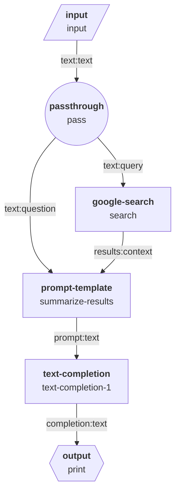

# search-summarize
---

```mermaid
graph TD;
input[/"`**input**
input`"/]:::input -- text:text --> pass(("`**passthrough**
pass`")):::passthrough
pass(("`**passthrough**
pass`")):::passthrough -- text:query --> search["`**google-search**
search`"]
pass(("`**passthrough**
pass`")):::passthrough -- text:question --> summarize-results["`**prompt-template**
summarize-results`"]
search["`**google-search**
search`"] -- results:context --> summarize-results["`**prompt-template**
summarize-results`"]
summarize-results["`**prompt-template**
summarize-results`"] -- prompt:text --> text-completion-1["`**text-completion**
text-completion-1`"]
text-completion-1["`**text-completion**
text-completion-1`"] -- completion:text --> print{{"`**output**
print`"}}:::output
```