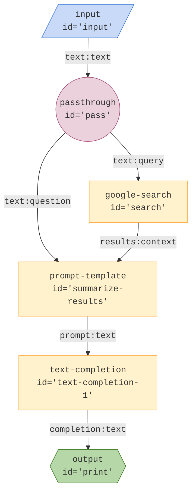

# search-summarize
---

```mermaid
%%{init: {'theme':'default', 'themeVariables': { 'fontFamily': 'Fira Code, monospace', 'background': '#fff' }}}%%
graph TD;
input[/"input
id='input'"/]:::input -- text:text --> pass(("passthrough
id='pass'")):::passthrough
pass(("passthrough
id='pass'")):::passthrough -- text:query --> search["google-search
id='search'"]
pass(("passthrough
id='pass'")):::passthrough -- text:question --> summarize-results["prompt-template
id='summarize-results'"]
search["google-search
id='search'"] -- results:context --> summarize-results["prompt-template
id='summarize-results'"]
summarize-results["prompt-template
id='summarize-results'"] -- prompt:text --> text-completion-1["text-completion
id='text-completion-1'"]
text-completion-1["text-completion
id='text-completion-1'"] -- completion:text --> print{{"output
id='print'"}}:::output
classDef default stroke:#ffab40,fill:#fff2ccff
classDef input stroke:#3c78d8,fill:#c9daf8ff
classDef output stroke:#38761d,fill:#b6d7a8ff
classDef passthrough stroke:#a64d79,fill:#ead1dcff
```