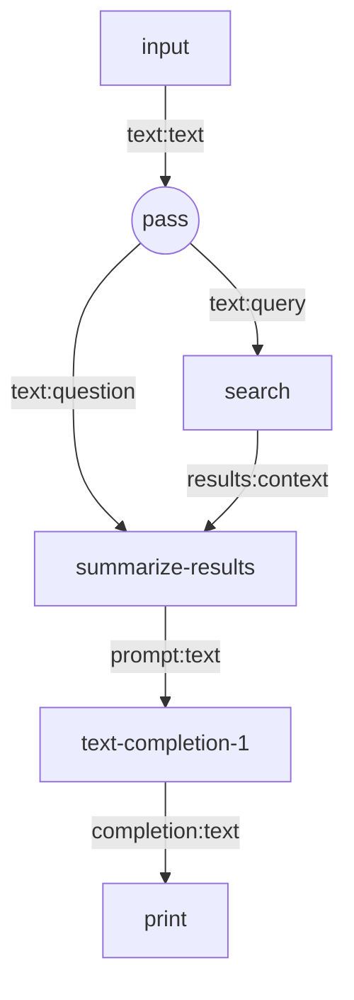

# search-summarize
---

```mermaid
graph TD;
input -- text:text --> pass((pass))
pass((pass)) -- text:query --> search
pass((pass)) -- text:question --> summarize-results
search -- results:context --> summarize-results
summarize-results -- prompt:text --> text-completion-1
text-completion-1 -- completion:text --> print
```