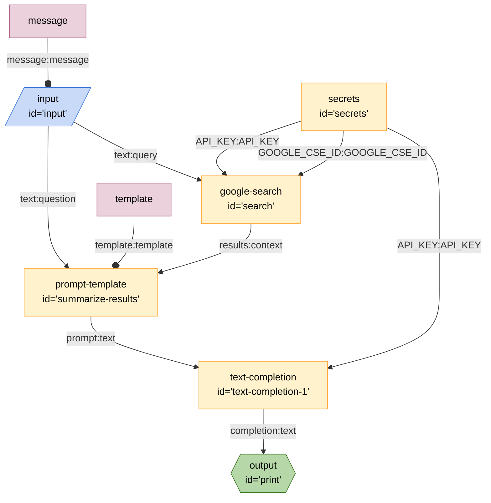

# search-summarize
---

```mermaid
%%{init: 'themeVariables': { 'fontFamily': 'Fira Code, monospace' }}%%
graph TD;
input[/"input
id='input'"/]:::input -- text:question --> summarizeresults["prompt-template
id='summarize-results'"]
secrets["secrets
id='secrets'"] -- API_KEY:API_KEY --> search["google-search
id='search'"]
secrets["secrets
id='secrets'"] -- GOOGLE_CSE_ID:GOOGLE_CSE_ID --> search["google-search
id='search'"]
input[/"input
id='input'"/]:::input -- text:query --> search["google-search
id='search'"]
search["google-search
id='search'"] -- results:context --> summarizeresults["prompt-template
id='summarize-results'"]
secrets["secrets
id='secrets'"] -- API_KEY:API_KEY --> textcompletion1["text-completion
id='text-completion-1'"]
summarizeresults["prompt-template
id='summarize-results'"] -- prompt:text --> textcompletion1["text-completion
id='text-completion-1'"]
textcompletion1["text-completion
id='text-completion-1'"] -- completion:text --> print{{"output
id='print'"}}:::output
messageinput[message]:::config -- message:message --o input
templatesummarizeresults[template]:::config -- template:template --o summarizeresults
classDef default stroke:#ffab40,fill:#fff2ccff,color:#000
classDef input stroke:#3c78d8,fill:#c9daf8ff,color:#000
classDef output stroke:#38761d,fill:#b6d7a8ff,color:#000
classDef passthrough stroke:#a64d79,fill:#ead1dcff,color:#000
classDef slot stroke:#a64d79,fill:#ead1dcff,color:#000
classDef config stroke:#a64d79,fill:#ead1dcff,color:#000
classDef slotted stroke:#a64d79
```