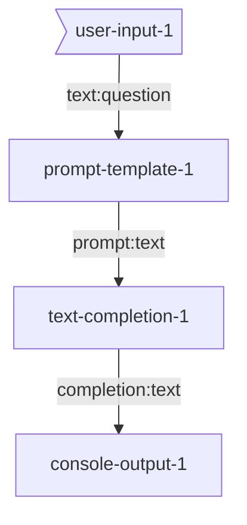

# simple-prompt
---

```mermaid
graph TD;
user-input-1>user-input-1] -- text:question --> prompt-template-1
prompt-template-1 -- prompt:text --> text-completion-1
text-completion-1 -- completion:text --> console-output-1
```