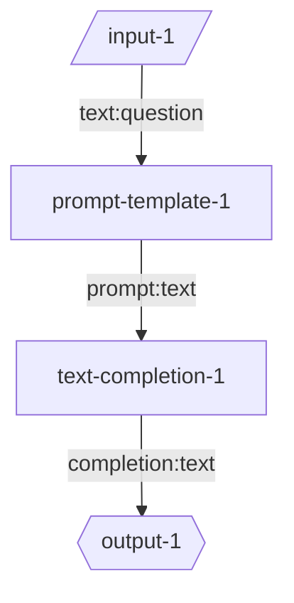

# simple-prompt
---

```mermaid
graph TD;
input-1[/input-1/] -- text:question --> prompt-template-1
prompt-template-1 -- prompt:text --> text-completion-1
text-completion-1 -- completion:text --> output-1{{output-1}}
```