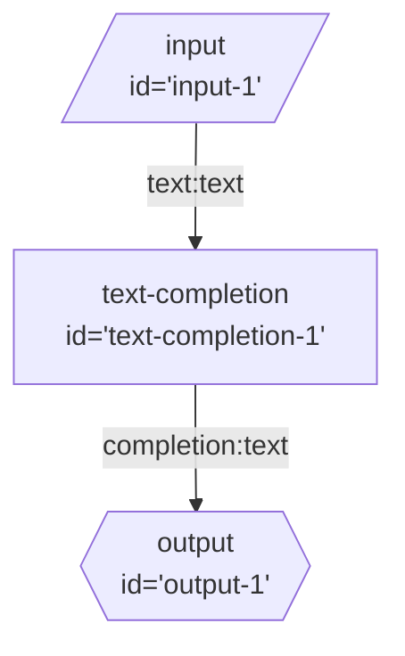

# simplest
---

```mermaid
graph TD;
input-1[/"input
id='input-1'"/]:::input -- text:text --> text-completion-1["text-completion
id='text-completion-1'"]
text-completion-1["text-completion
id='text-completion-1'"] -- completion:text --> output-1{{"output
id='output-1'"}}:::output
```