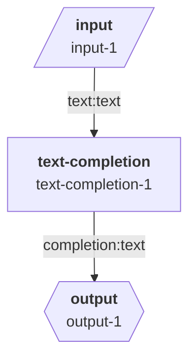

# simplest
---

```mermaid
graph TD;
input-1[/"`**input**
input-1`"/]:::input -- text:text --> text-completion-1["`**text-completion**
text-completion-1`"]
text-completion-1["`**text-completion**
text-completion-1`"] -- completion:text --> output-1{{"`**output**
output-1`"}}:::output
```