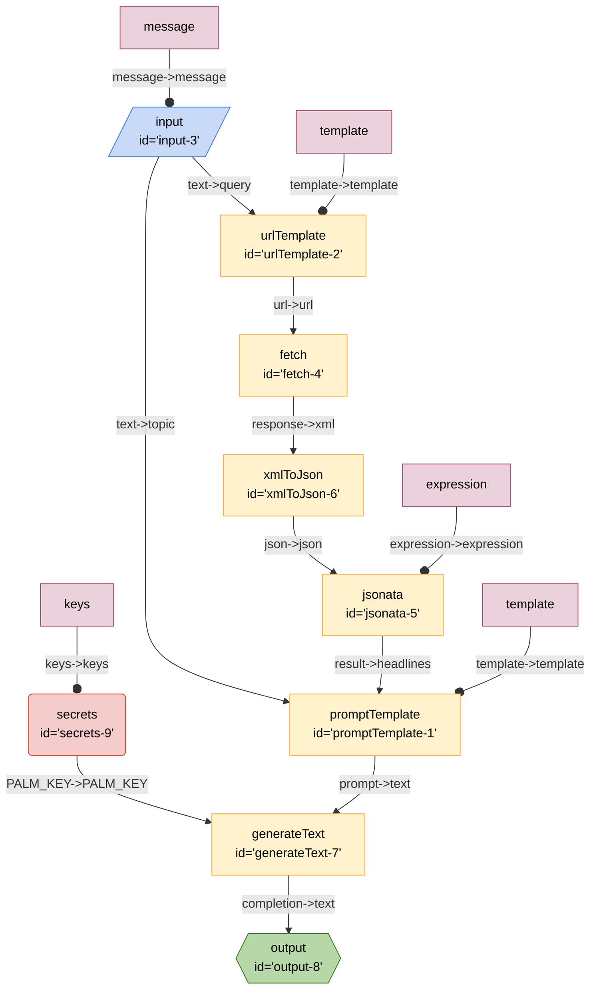

# Google News Diagram

```mermaid
%%{init: 'themeVariables': { 'fontFamily': 'Fira Code, monospace' }}%%
graph TD;
input3[/"input
id='input-3'"/]:::input -- "text->topic" --> promptTemplate1["promptTemplate
id='promptTemplate-1'"]
input3[/"input
id='input-3'"/]:::input -- "text->query" --> urlTemplate2["urlTemplate
id='urlTemplate-2'"]
urlTemplate2["urlTemplate
id='urlTemplate-2'"] -- "url->url" --> fetch4["fetch
id='fetch-4'"]
jsonata5["jsonata
id='jsonata-5'"] -- "result->headlines" --> promptTemplate1["promptTemplate
id='promptTemplate-1'"]
xmlToJson6["xmlToJson
id='xmlToJson-6'"] -- "json->json" --> jsonata5["jsonata
id='jsonata-5'"]
fetch4["fetch
id='fetch-4'"] -- "response->xml" --> xmlToJson6["xmlToJson
id='xmlToJson-6'"]
generateText7["generateText
id='generateText-7'"] -- "completion->text" --> output8{{"output
id='output-8'"}}:::output
secrets9("secrets
id='secrets-9'"):::secrets -- "PALM_KEY->PALM_KEY" --> generateText7["generateText
id='generateText-7'"]
promptTemplate1["promptTemplate
id='promptTemplate-1'"] -- "prompt->text" --> generateText7["generateText
id='generateText-7'"]
templatepromptTemplate1[template]:::config -- "template->template" --o promptTemplate1
templateurlTemplate2[template]:::config -- "template->template" --o urlTemplate2
messageinput3[message]:::config -- "message->message" --o input3
expressionjsonata5[expression]:::config -- "expression->expression" --o jsonata5
keyssecrets9[keys]:::config -- "keys->keys" --o secrets9
classDef default stroke:#ffab40,fill:#fff2ccff,color:#000
classDef input stroke:#3c78d8,fill:#c9daf8ff,color:#000
classDef output stroke:#38761d,fill:#b6d7a8ff,color:#000
classDef passthrough stroke:#a64d79,fill:#ead1dcff,color:#000
classDef slot stroke:#a64d79,fill:#ead1dcff,color:#000
classDef config stroke:#a64d79,fill:#ead1dcff,color:#000
classDef secrets stroke:#db4437,fill:#f4cccc,color:#000
classDef slotted stroke:#a64d79
```
