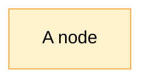
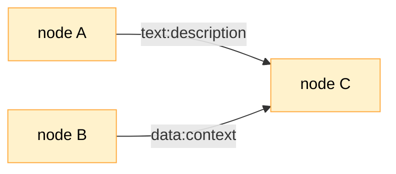
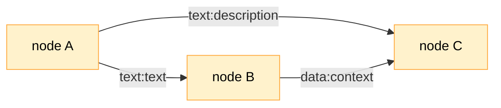
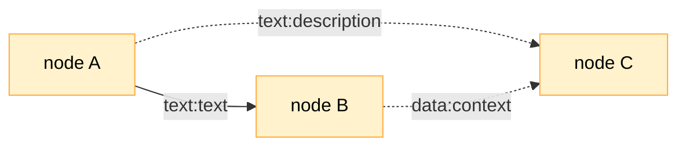
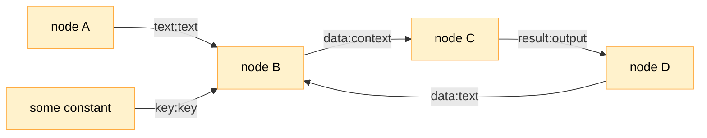
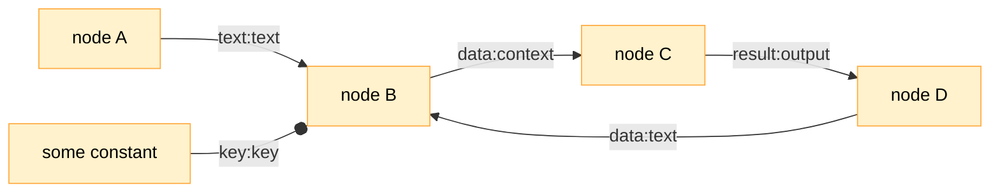

# Graph Runner

The WIP bit of code that traverses the graph and invokes various node handlers.

## Nodes and Edges

A graph is nothing without nodes. Graph nodes are also sometimes called vertices, but here, we'll stick with the term 'node'.

In this world, each node is a function. When run, this function takes in a bag of properties (a `Record<string, unknown>` in TypeScript) and returns a bag of properties. The idea behind making nodes functions was that it should be very easy to write one.

The whole point of graphs then is about establishing the order in which these functions run and what property bags they take and return. By arranging a small set of functions into various graphs, we can build pretty much anything -- very, very quickly.

To achieve that, we need edges. Edges are also a necessary part of any graph. An edge has a direction, and it connects a node to another node.

The direction of the edge determines the direction of both control and data flow. The function that is the node at the head of the edge will be invoked after the node at the tail of the edge.

As its input, the node at the head of the edge will receive the output of the node at the tail of the edge.

To clearly communicate what data actually flows through this edge, we need to specify which output property connects to which input property. For example, if I want to send the `description` property from the output of `node A` as a property `text` in the input of `node B`, I would mark the edge like this:

The diagram above describes the following sequence:

- run function represented by `node A`
- get its output
- find the `description` property in the output
- pass it as the `text` property to the function represented by `node B`
- run function represented by `node B`

If I want to send all properties from the output of `node A` as properties in the input of `node B`, I would mark the edge like this:

The above basically says:

- run function represented by `node A`
- get its output
- pass all properties from the output as properties to the function represented by `node B`
- run function represented by `node B`

Finally, if I want to send nothing between the two nodes, I would leave the edge unmarked:

In this case, we will have flow of control, but not data, resuling in this sequence:

- run function represented by `node A`
- run function represented by `node B`

## Traversal

Many edges can connect to the same node, and many edges can come out of the same node. This is how we can build complex graphs out of simple nodes.

With so many edges and nodes, it might be tricky to figure out the actual sequence of events.

Figuring this sequence out is the job of the graph traversal machinery. It figures out which nodes to start with and how and when to visit the next ones.

### Entry points

First, the traversal machinery finds the entry points into a graph. These are the nodes that have no incoming edges. In the diagram below, `node A` and `node B` are entry points, and `node C` is not.

### Opportunities

The traversal machinery thinks in terms of opportunities and maintains a list of them. As new opportunities for visiting nodes arise, they are added to the end of the list.

For instance, `node A` and `node B` are the first two opportunities in the diagram above. After visiting `node A`, the traversal machinery will add `node C` as the next opportunity, because there's an edge connecting `node A` to `node C`.

### Required edges

In the last diagram, the order of invoking nodes is pretty easy to figure out: it's either `node A`, `node B`, `node C`, or `node B`, `node A`, `node C`. The structure of the graph tells us that the order of invoking `node A` or `node B` is not important, as long as `node C` goes last. But what if we have a graph like this?

What is the right order of invoking nodes here?

To make sense of this, the traversal machinery looks at the incoming edges (the heads) of every opportunity and determines whether it has collected all properties for each edge. If it has, the machinery deeps the opportunity as ready to be visited. If it hasn't, the machinery skips this opportunity.

In the diagram above, `node A` will be the first opportunity (since it's the entry point). After visiting this node, the machinery will uncover two more opportunities: `node C` and `node B`.

Let's suppose it first looks at the heads of the `node C` opportunity. There are two:

1. `description`, supplied by the `text` output property of `node A`, and
2. `context`, supplied by the `data` output property of `node B`.

Since the traversal machinery hasn't visited `node B` yet, the output property `data` hasn't yet been produced, so the corresponding `context` property isn't yet available, either. This means that the `node C` opportunity is not ready to be visited yet. The `node C` opportunity will be skipped, and the machinery will proceed to visit `node B`.

A different way to think of it is that all edges with property names are deemed "required" by default. The traversal machinery will only visit a node if all required incoming edges are satisfied.

### Optional edges

In some cases, we might not want the machinery to presume that the edge is required. In such cases, we can mark an edge as "optional".

Let's take the previous diagram and mark the edges incoming into `node C` as optional:

In this case, the `node C` will be visited twice: once with the `description` property, and once with the `context` property. The sequence of node visits will look like this:

1. `node A`
2. `node C` (with description)
3. `node B`
4. `node C` (with context)

### Constant edges

An interesting property of computing required edges is that the properties that are passed along the edges are being collected for future consumption for every node that could be visited. Once the node is visited, the properties are consumed, and need to be collected all over again for the node to be re-visited.

This is not always desirable. Sometimes, we want to pass the same value of the property to the same node every time the node is visited. In such cases, we can mark the edge as "constant".

Consider this graph:

Here, we have two entry points:

1. `node A`, which provides `text` input to `node B`, and
2. `some constant`, which provides `key` input to `node B`.

There is also a loop that, via `node C` and `node D`, brings the `text` output of `node D` back to `node B`. Perhaps there's some refinement or accumulation going on.

Unfortunately, for this loop to actually work, the `some constant` node needs to be revisited as well. If we are sure that the value of `key` will always be the same, we can mark the edge as "constant" as follows:

Once that is done, the `key` property will always be available for consumption, no matter how many iterations of the loop we go through.

The name "constant" hints at the typical application of this flag: use it to represent and pass constant values within the graph.

## Graph composition techniques

### Gates

### And/or

### Loops

## Core Node Handlers

Here are some node handlers that are seen as core to the process of graph traversal.

### `input`

Use this node to ask for input from inside the graph. The input is supplied by an implementation of `GraphTraversalContext` that is being used for graph traversal, which is a fancy way of saying that it is up to the application that asked to traverse the graph to supply the input.

This node accepts a property bag (a `Record<string, unknown>` in TypeScript) and passes it along, without any modification, as this node's output.

### `output`

Use this node to get data out of the graph. The output is sent to an impelmentation of `GraphTraversalContext` that is being used for graph traversal. Just like `input`, it takes a property bag and sends it off to the context, unmodified.

### `passthrough`

This is a no-op node. It takes the input property bag and passes it along as output, unmodified. This node can be useful when the graph needs an entry point, but the rest of the graph forms a cycle.

### `include`

Use this node to include other graphs into the current graph. It recognizes two properties in the input property bag:

- `path`, which specifes the file path to the graph to be included. This property is required.
- `slotted`, which specifies slotted graphs that will be used to populate `slot` nodes in the included graph. This property is optional.

The rest of the inputs in the property bag are passed along to the included graph as its inputs. The included graph will be traversed in its own context, an instance of `IncludeContext`. This context will collect all outputs of the graph and pass them along as outputs of the `include` node.

This enables treating the included graph as a kind of a node: it takes inputs (aside from `path` and `slotted` properties) and provides outputs.

### `slot`

Use this node to specify a slot in a graph. Adding a `slot` node turns a graph into a template: each slot represents a placeholder that must be filled in when the node is included into another graph.

The node takes a `slot` property, which specifies the name of the slot, and passes the rest of arguments to the slotted graph. The value of the `slot` property is used to match the slot with one of the slotted graphs that is passed to the `include` node.

### `reflect`

This node is used to reflect the graph itself. It has no required inputs and provides a JSON representation of the graph as a `graph` output property. This can be used for building nodes to study the graph and its structure.

## Additional Node Handlers

These are the additional node handlers that are useful for building generative language applications.

### `prompt-template`

Use this node to populate simple handlebar-style templates. The node takes a required `prompt` property, which is a string that contains the template. The template can contain zero or more placeholders that will be replaced with values from the input property bag. Specify placeholders as `{{propertyName}}` in the template.

The node will replace all placeholders with values from the input property bag and pass the result along as the `prompt` output property.

### `local-memory`

Use this node as a simple text line-based accumulator. Every input is added to the list as a line, and the list is passed the `context` output property. Every time the node is visited by the graph, the list keeps growing.

### `run-javascript`

Use this node to execute JavaScript code. The node takes a required `code` input property, which is a string that contains the code to be executed. It also takes an `name` input property, which is a string that specifies the name of the function that will be invoked to execute the code. If not supplied, the `run` function name will be used.

The code is executed in a new V8 context, which means that it cannot access any variables or functions from the outside.

The node will pass the result of the execution as the `result` output property.

### `jsonata`

Use this node to execute [JSONata](https://jsonata.org/) expressions. The node takes the following properties:

- `expression` input property, which is a string that contains the expression to be executed. This is a required property.
- `json` input property, which is a JSON object that will be used as the context for the expression. This is a required property.
- `raw` input property, which is a boolean that specifies whether the result of the expression should be passed as-is (`true`), or it should be passed as the `result` output property (`false`). This is an optional property, and its default value is `false`.

The node will pass the result of the execution as the `result` output property, unless the `raw` property is set to `true`.

### `text-completion`

This is a PaLM API text completion node. It requires an `API_KEY` environment variable to be defined, containing the Google Cloud Platform API key for the project has the "Generative Language API" API enabled.

The node takes `text` input property, which is used as the prompt for the completion. The node will pass the result of the completion as the `completion` output property.

You can also specify the `stop-sequences` property as an array of strings. These will be passed as the stop sequences to the completion API.

### `google-search`

Use this node to invoke the Google Custom Search API.

This node requires two environment variables to be defined:

1. The `API_KEY` environment variable, containing the Google Cloud Platform API key for the project has the "Custom Search API" API enabled.

2. The `GOOGLE_CSE_ID` enviornment variable to be defined. The `GOOGLE_CSE_ID` is the Programmable Search Engine ID. You can create one [here](https://programmablesearchengine.google.com/). When configuring the search engine, make sure to enable the `Search the entire Web` option.

The node takes one required property, `query`, which is a string that contains the query to be passed to the search API.

The node will pass the result of the search as the `results` output property, formatted as a multi-line string, each line a `snippet` from the [Custom Search Engine response](https://developers.google.com/custom-search/v1/reference/rest/v1/Search#Result).
